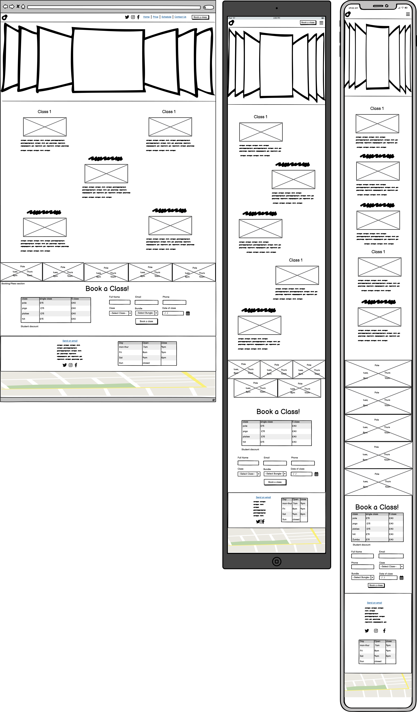

# Zenair Wellness Center

[Link to Live Website](https://daniquej-r.github.io/Milestone-Project-1/index.html)

[GitHub Repo](https://github.com/DaniqueJ-R/Milestone-Project-1)

*** 

## About  

The Zenair Wellness Center is a service that provides structured and fun fitness classes for all ages and genders. Its focus is on strengthening the bond between person and Body and taking care of mental and physical health. Patrons using this website can explore alternative fitness options to suit their lifestyles, such as scheduling, pricing, contact information, and a booking form for interested and recurring participants. 

***

## Index – Table of Contents

* [User Experience R&D](#user-experience-research-and-design)
 * [Strategy](#Strategy)
 * [Scope](#Scope)
 * [Structure](#Structure)
 * [Skeleton](#Skeleton)
 * [Surface](#Surface)
* [Features](#features)
* [Testing](#testing)
* [Bugs](#bugs)
* [Deployment](#deployment)
* [Credits](#credit)

*** 

## User Experience Research and Design

### Strategy

This website is targeted at active members and potential members of Zenair Wellness Center, so specific information such as pricing, location, and information on the classes offered are the main aspects of the design for this website. The website should inform users of pricing, discounts, schedule, location, contact information, and opening hours. There is a form to make booking a class or sending any inquiry to the studio easier to ensure more clients.

#### Leading User Stories

* As a potential gym member, I need easy navigation and a user-friendly design, including a responsive layout for my device to find information quickly and efficiently without frustration. (Must Have)

* As a Prospective Customer, I need to find essential information such as location, contact details, and opening hours clearly and concisely so I can easily plan my visit or contact the gym. (Must Have)

* As a potential member, I want to explore a selection of different classes on the website to discover other services and decide which ones I might be interested in trying. (Must Have)

* As an active gym member, I need to see the class schedules with the time and date for each weekly class to get there on time and fit into my schedule. (must have)

* As a potential gym member, I need a clear page to confirm my inquiry or booking has been completed to know my inquiry was sent and when to get a response (Must have)

* As a potential gym member, I need high-definition photos and videos clearly showing life at the wellness centre and what classes generally entail. (Must have)

* As a potential gym member, I need an easy way to contact the gym from the website for inquiries regarding bookings, cancellations, and general inquiries (Should have)

* As a potential member, I want a section where I can easily find the answers to questions I may have about classes and expectations before I make a decision (Could have)

* As a Regular Customer, I want to sign up for newsletters and updates to stay informed about special offers, new games, and upcoming events. (Could Have)

* As a potential member, I want to see other members' experiences and testimonials so I can feel more comfortable about what to expect (Could Have)

#### Primary strategic aims for the website
* Advertise wellness centres for the betterment of people who wish to exercise mindfully.
* Advertise various classes to increase revenue that funds the cost of the studio and instructors.
* Introduce alternative methods of health and wellness to a boarder audience. 

How will I achieve this?

- Overall, the site aims to have a relaxing and 'Zen' ambience from the initial view
- The home page contains necessary elements such as:
- A captivating cover photo to grab users' attention off the bat
- All the initial basic information someone may need and indicate where to find more information. 
- An optional newsletter sign-up so they can receive information on possible parties and discounts
- The schedule and pricing page provides class descriptions, offerings, transparent pricing, and a booking section for easy user understanding.
- The inquiry page will have a relevant FAQ section and contact us form.
- The footer provides the user with contact details and opening hours for them to get in touch
- The footer provides the user with social links so they can learn more about us

### Scope

A more thorough approach will be adopted to ensure users have all the needed information in ready-to-view locations per the strategy section mentioned above. 

Please see the features below: 

#### In-Scope Features
* Homepage that clearly informs what the website represents and offers.
* A menu that intuitively navigates to the other website pages.
* Imagery from classes to help convey the aim of the website and individual pages.

* Provide information on; 
 * Each class offered and a description of each class
 * The schedule and instructor for each class,
 * The location and contact information,
 * The pricing and any discounts available for each class
 * A booking form for classes
 * A section with commonly asked questions
 * Testimonies from previous and current members,
 * Allow users to stay informed of changes and discounts using a newsletter.
 * A carousal of images as the Hero images 
 * Easy navigation from page to page and social media 

#### Out-of-Scope Features

* **Online booking system** Each class has a maximum capacity, which members have to book beforehand to participate in each class. We wish to implement a calendar system showing each class on their respective dates and times, with class availability and pricing making it easier for members to book. They can also reserve gym equipment rental (Yoga mat, dumbbells, etc) for their classes.

* **Online payment system** To follow or be developed in parallel with the 'Online booking system', users and the instructors could benefit from having a payment system to avoid handling cash and to know how many members will be present in each class. Users could also reserve several classes at a time.

* **User accounts** Users could benefit from having an account where they can track class attendance, payments, and potential rewards. For example, every 10th class attended is free.

* **Most popular classes** This tag lists the most popular classes, informing users what classes others gravitate to most. It also provides more information on these classes, their expectations, benefits, and any discounts. 

#### Scrapped Scope Features

* **Separated Booking Form from Inquiry Form** Initially, the inquiry form would remain on the Contac Us page, and a separate smaller form specifically for booking classes would have been on the Classes page; however, it was seen that as the two were similar, and the chances of users having questions or requests along with their bookings increase when taking into consideration the newest members booking for the first time, it was decided to merge the tables, causing less confusion for members. 

This idea was initially considered when making the Wireframes, hence the difference in page layouts compared to the finished product. 

* **Call to action button under each class** This idea was first to have a separate call to action button so users could select a class and be taken to the above form with the class already selected. Later, this morphed into the Booking System mentioned above, where users would be able to have an interactive calendar of each class, making bookings more streamlined for newer users. Users would also be able to make payments online. 

### Structure

This section will speak to the intended structure of the overall site across the four pages (including the homepage):

* A homepage with a horizontal navigation bar will greet users across each page. This will lead to Home, Classes, and Contact Us pages with a button leading them directly to the Booking form. It will also have links to our Socials for easy access

* The homepage header, navigation menu, and footer will be consistent throughout the site. 

* To assist users, the homepage will first display a little section about Zenair Wellness Center and our goals, with a section for users to sign up for our newsletters. 

* Afterwards, the essential information for the class days, dates, times, and cost. 

* Lastly, there will be a section for the previous testimonies and a promotional video to help users better understand what we offer and why. 

* The Footer will contain further essential information for users, such as Contact information, Social Media links, opening hours, and a map of the studio, to attract users who are interested and have already reached the end of the page and get a better idea of our location. 

### Skeleton

Key to this website being accessible to all active and potential members is a simple but sleek design that is intuitive to navigate and clear to read. 
Retaining a clean and straightforward design throughout all pages is crucial to avoid confusion for potential members, as this can deter them from continuing to the booking form. 

The homepage will be the hub of the website, where essential information and the initial call to action are displayed. To support the users' journey, there is a logical navigation menu that progressively reveals information in the order the user expects;

 * Want the general information on classes offered? Click the dropdown from 'Home to Pricing'.
 * Want to know previous members' experience? Click the dropdown from 'Home to Testimonies'.
 * Want more information on the classes we offer? Click 'Classes'.
 * Want more information on the class schedule? Click 'Classes to Schedule'.
 * Have further questions on classes offered? Click 'Contact us'.
 * Want to book a class? Click the call to action button on all pages, 'Book a Class'.

I designed detailed wireframes for this project to bring my vision for the site to life. Check out the links below to explore the mobile, tablet, and desktop mockups: [Balsamiq](https://balsamiq.com/wireframes/) (see samples below—all wireframes can be found within the [Repo](wireframes)).

Consideration was given to desktop, tablet, and mobile users. The website is responsive through differing screen widths, with the final design being responsive at screen widths from 320-640px, 980-1200px, 1200-1600px, and 1600-5000px. This should ensure accessibility on any device or desktop monitor.

#### Homepage Wireframe 

#### Classes Wireframe 

#### Contact Us Wireframe 

#### Success Wireframe 

### Surface

Considering that retention and invitation to new members were a key design criterion, the developed visual language offers contrast using a simple yet calming colour palette, readable and sleek fonts, and clear layouts. Throughout the website, this language has been applied consistently to promote a consistent user experience, with the most important links and information easily recognized.

#### Color Scheme

From the beginning, I knew I wanted Earth tones to establish the tone of the site and the company's goal. I then located photos that matched the colour scheme and selected suitable colours using IMAGECOLORPICKER.com. I then used the colour grader site to check the contrast scores. The grid showed me which background colours match which text colour, so the site is accessible to everyone.

#d8c29c
#2e231d
#3d231d
#664d31
#cc7c40

[Colour contract checker](https://contrast-grid.eightshapes.com/?version=1.1.0&background-colors=&foreground-colors=%23d8c29c%0D%0A%232e231d%0D%0A%233d231d%0D%0A%23664d31%0D%0A%23cc7c40%0D%0A%2388715d&es-color-form__tile-size=compact&es-color-form__show-contrast=aaa&es-color-form__show-contrast=aa&es-color-form__show-contrast=aa18&es-color-form__show-contrast=dnp) 

#### Classes Wireframe 

#### Images

As the photos were not provided for this project beforehand, a decision was made to use free images from online sources to convey what the website represents. It was important for the images to communicate that people of differing ages and genders participated in different classes, keeping with the company's theme of inclusivity for all. 

Images were sourced from [Freepiks](https://freepiks.com/) for the homepage and throughout the project. All images have alt attributes and/or Arial labels to support users with screen readers and the website's ranking.

#### Video

The video is also a mockup generated using the AI site [Ai.invideo](https://ai.invideo.io/) as a generated promotional video detailing more of Zenair Wellness Center's values and general goal for the members. 

***

## Features

### Universal Features

##### Navigation Menu

The header element, complete with the Zenair logo and Navigation Menu (nav-menu), is a constant throughout the website. The layout has been centrally and fixed to the top of the page. The font mixed with the colour pallet was specifically selected to provide a friendly, comfortable feel for new users. The logo will intuitively return the user to the homepage, and depending on the page you are on, the nav-menu has matching dropdowns for each section on the respective pages, making it easier for users to navigate each page. 

For devices under 640px wide, the nav-menu reduces to a collapsible dropdown style, with menu options aligned to the left for ease of selection for most users.

##### Footer 

The dark brown background, matched with the white text, follows the same design as the nav menu at the top of the page. This theme aims to be complimentary without distracting users from page content. The footer's role on this website is to clearly state the company location, contact information, opening hours, official social media accounts, and a map with the studio's location, making it easier for users to visualize their journeys at first glance. 

The footer has been divided into three sections: the left side contains contact information with responsive icons to support user navigation, the right side lists the studio's opening hours, and the bottom section includes the aforementioned map spread across the footer and page itself. As with the nav menu, the layout and fonts are styled appropriately for devices under 640px wide.

##### Metadata

To support the following strategic aims;
 * Advertise fitness classes for the betterment of self in your fitness or healing journey.
 * Advertise fitness classes to increase revenue and fund the cost of the instructors and overall studio maintenance. 
Meta data has been included within the website's HTML head element to increase the traffic to this website. Furthermore, the individual site pages have been titled appropriately as another method of informing users where they have navigated.

##### Redirection

A 'Thank you' page has been added to the website to confirm a booking or inquiry. This page informs users that their message was successfully sent and that they should receive an email response within 1-3 business days.  

### Page-specific features

##### FAQ's Vertical Accordion

To ensure users are given ample knowledge before attending their classes, the section above the inquiry form contains nine commonly asked questions to inform users about attending a class. It was essential to ensure the page wasn't overloaded with content, which may result in users being deterred and not finding the answer to their questions. With this in mind, the vertical accordion provides a concise list of the questions, with answers available as a dropdown when required. This FAQ format can be easily amended if Zenair requires any changes to information or wishes to add new questions.

##### Sign-up Form

To deliver the strategic aim of "Introduce alternative methods of health and wellness to a boarder audience", a page dedicated to questions, answers, and contacting the staff was implemented. The form requests six critical pieces of information to best assist users: Full Name, Phone Number, Email, contact reason, Date of class, and a message to explain the query. This ensures that users are answered thoroughly and there is a lesser chance of miscommunication. 

##### Sign-up Form

To deliver the strategic aim of "Introduce alternative methods of health and wellness to a boarder audience", a page dedicated to questions, answers, and contacting the staff was implemented. The form requests six critical pieces of information to best assist users: Full Name, Phone Number, Email, contact reason, Date of class, and a message to explain the query. This ensures that users are answered thoroughly and there is a lesser chance of miscommunication. 

***

## Testing 

Throughout the Build phase, Chrome Developer Tools are used to ensure all pages are developed to remain intuitive, responsive, and accessible across all device widths. The pages were designed at 1400px wide, reducing to 320px for mobile devices. These tools and others were used for the Testing phase. 

The following sections summarise the tests and results.

### Code

Code has been tested using the [HTML Validator](https://validator.w3.org/) and [CSS Validator](https://jigsaw.w3.org/css-validator/) with the following results:

* **index.html** - 0 Errors / 0 Warnings
* **classes.html** - 0 Errors / 0 Warnings
* **contact-us.html** - 0 Errors / 0 Warnings
* **success.html** - 0 Errors / 0 Warnings
* **style.css** - 0 Errors / 20 warnings

The warnings are due to 1) import of the Google fonts, 2) a webkit extension for Safari support of the flip-card effect used on the home page, and  3) using the root format for most colouring on the site (--var).

### Browser

To ensure site visitors can view and interact with Zenair's website, cross-browser testing was performed on the test scenarios listed in the table below.

To achieve a 'Pass,' the following criteria had to be met across all website pages;
1. All nav-menu links work as designed and lead to the correct locations. 
2. All images/videos are loaded and displayed correctly at the differing media queries
3. All text uses 'Montserrat Alternates' and 'Sofia Sans Semi Condensed' font style
4. All external links activate when clicked and open in a new tab or browser window
5. The form as part of the 'Contact Us' page allows full completion and submission
6. The form as part of the 'Contact Us' page prevents the form from being sent unless all areas are filled
7. Header elements can be clicked to return users to the homepage from any site page
8. All pages retain layout integrity throughout the Body and across the differing media queries
9. All Page footers are responsive, with hovering changes responsive to the mouse

| Browser                    | Version | Test Facility  | Pass | Partial Pass | Fail | Fail                                                   |
| -------------------------- | ------- | -------------- | ---- | ------------ | ---- | --------------------------------------------------------------------------------------- |
| Microsoft Edge (Win 11)    | 96      | ASUS Laptop   | Pass |              |      |                                                                                         |
| Google Chrome (Win 11)     | 96      | ASUS Laptop   | Pass |              |      |                                                                                         |
| Firefox (Win 11)           | 95      | ASUS Laptop   | Pass |              |      |                                                                                         |
| Safari (macOS Mojave)      | 12      | lambdatext.com | Pass |              |      |                                                                                         |
| Opera (macOS Sierra 10.12) | 74      | lambdatext.com | Pass |              |      |                                                                                         |

### Device

Testing was performed on the test scenarios listed in the table below to ensure visitors can view and interact with Zenair's website on differing devices.

To achieve a 'Pass,' the following criteria had to be met across all website pages;
1. All nav-menu links work as designed and lead to the correct locations. 
2. All images/videos are loaded and displayed correctly at the differing media queries
3. All text uses 'Montserrat Alternates' and 'Sofia Sans Semi Condensed' font style
4. All external links activate when clicked and open in a new tab or the app
5. The form as part of the 'Contact Us' page allows full completion and submission
6. The form as part of the 'Contact Us' page prevents the form from being sent unless all areas are filled
7. Header elements can be clicked to return users to the homepage from any site page
8. All pages retain layout integrity throughout the Body and across the differing media queries

| Device       | Type               | Pass | Partial Pass | Fail |                                                                                                                                                     |
| ------------ | ------------------ | ---- | ------------ | ---- | ---------------------------------------------------------------------------------------------------------------------------------------------------------------------------------------- |
| Mobile Phone | iPhone SE          | Pass |              |      |  |
| Mobile Phone | Samsung Galaxy S20 Ultra | Pass |              |      |
| Tablet       | iPad Air        | Pass |              |      |                                                                                   |
| Laptop       | ASUS Zenbook 14"   | Pass |              |      |                                                                                                     
### Accessibility

Each page of this website has been tested with [Wave (Web Accessibility Evaluation Tool)](https://wave.webaim.org/) with the following errors and recommendations that were fixed: 

* **2 Contrast Errors** Adequate text contrast is necessary for all users, especially users with low vision regarding the left and right controls in the testimonies area.

* **HTML5 video or audio** video defines videos such as movie clips or other video streams. Video content with audio must have synchronised captions and a transcript. Once a transcript is received, it will be updated.

* **Skipped heading level** The class titles' heading level is skipped on the classes page. This was fixed by changing them to H£ tags instead of h5, and the above were already H2 tags. 

### User Stories

The leading user stories have been tested to ensure the priority aims of the website have been delivered. 
Below is a summary of the test results.

* As a potential gym member, I need easy navigation and a user-friendly design, including a responsive layout for my device to find information quickly and efficiently without frustration.
    * All pages score a consistent 100% when tested for Accessibility with Lighthouse. In addition to no errors being found when tested with [Wave (Web Accessibility Evaluation Tool)](https://wave.webaim.org/). This would suggest the site can be navigated by those with accessibility requirements and/or using a screen reader with ease.

* As a Prospective Customer, I need to find essential information such as location, contact details, and opening hours clearly and concisely so I can easily plan my visit or contact the gym.
    * The homepage offers this key information within the homepage, and is all easy to locate within the page. Furthermore the studio address, number, email, opening hours and a map of the location are consistently displayed in the Footer on all pages.  

* As a potential member, I want to explore a selection of different classes on the website to discover other services and decide which ones I might be interested in trying.
    * From either clicking to the 'Classs' page or scrolling on the Home page, users can access informaiton regading the classes offered, price per class, and the schedule for each class easily on the pages. 

* As an active gym member, I need to see the class schedules with the time and date for each weekly class to get there on time and fit into my schedule.
    * This information is clearly displayed on the Classes page with the nav-menu having a link directly to that section for easy viewing. This also infomres who will be the instructor for each class in an easy to read responsive visual grid, making it easy to see the date, time and class you desire. 

* As a potential gym member, I need high-definition photos and videos clearly showing life at the wellness centre and what classes generally entail. 
    * High defenition photos and videos were sourced using sites like Freepik, all cohesive and responsive for all devices and the overall design of the colour scheme of the site. Photos is accessable to screeneaders or if the link is broken with a small description of each photo added. 

* As a potential gym member, I need an easy way to contact the gym from the website for inquiries regarding bookings, cancellations, and general inquiries 
    * A booking form was implimented on the Contact us screen, allowing members to book classes, rent equiptment, cancel classes and more. This was created with the requrment of all lines to be filled, andmembers are unable to proceed with sending the inquiry until they are filled. 
    
* As a potential member, I want a section where I can easily find the answers to questions I may have about classes and expectations before I make a decision 
    * On the Contact us Page, a FAQ section was added with 9 commonly asked questions, easily accessable from the Nav-menu. On the Contact us page, the nav-menu has two headings taking you to the respective FAQ sections for easy navegation. 

* As a Regular Customer, I want to sign up for newsletters and updates to stay informed about special offers, new games, and upcoming events. 
    * A breif descrition of the company and its goals followed by a sign up button is located at the top of the Home page, and beside the About us section on Tablets and bigger sized devices. The button leads to a pop-up requesting the name and phone number, with a check box for users to request SMS promo messages as well as the emails. Once done, they are lead back to the index page to continue browsing. 
    
* As a potential member, I want to see other members' experiences and testimonials so I can feel more comfortable about what to expect 
    * At the end of the Home page, a section showcases testimonials from past and current members, highlighting their experiences over time. This helps new visitors gain insight into the supportive and welcoming environment at Zenair Wellness Center. 

### Performance

Using Lighthouse performance testing within Chrome Developer Tools, every page's performance was tested on desktop and mobile devices. The results from this testing are outlined in the tables below. The tests highlighted a constant theme of image sizes being too large and elements such as bootstraps and Google fonts causing a longer loading time for users. All files have been appropriately right-sized and formatted to improve the user experience, and we will continue to work on these elements to reduce the loading time. In the meantime, the "class="d-block w-100" was removed from the carousel images as suggested by Lighthouse. 

**Lighthouse test - Mobile**

Lighthouse Home Mobile

Lighthouse Class Mobile

Lighthouse Contact Us Mobile

Lighthouse Success Mobile

**Lighthouse test - Desktop**

Lighthouse Home Desktop

Lighthouse Class Desktop

Lighthouse Contact Us Desktop

Lighthouse Success Desktop

## Bugs

### Bug Fixes/ General Improvements 

* **Setting Body to 2000px and resizing photos** — The Lighthouse results initially for the Index and Classes page indicated that the photos were too large for the page, leading to longer loading times and a poor user experience. 

     - __Fix:__  When I Showed this to my mentor, his solution was to set a max width of 2000px for the Body of the page, resize the photos to 2000px max, and change them to .webp instead of .jpg. This resulted in the pages getting the results from Lighthouse mentioned below

* **Nav-Menu dropdown appearing on Left side of screen** — When I first added the Nav Menu, the drop-down section was not correctly positioned, causing it to show on the left side of the page instead of under the heading it was created for. 

     - __Fix:__ To fix this, I went through each line and noticed that the area was not within the correct area, then I reinstalled the code for the dropdown and nav-menu, which now shows the dropdown under the correct area after testing. 

* **Resizing Pricing Table font to remove overhanding** - After adding the correct information to the pricing table on the Homepage, I noticed it will overflow on the page when in smaller devices. 

     - __Fix:__ To combat this, I used a Media Query and changed the font, making it that it was 0.8rem on small decided, and increases to 1.3?rem on larger devices. 

* **Using bootstrap arrangement for spacing and location of classes section** - During the sizing and styling of the Class section, there was an issue with the spacing, where the Zumba class would not be aligned Center and the other classes would not align left or right respectively. 

     - __Fix:__ I referenced the Boardwalk Games coding and Bootstraps Documents, realizing the Row and containing classes were not in the correct place, and the column sizes were incorrect. In correcting this, The X formation was possible, allowing it to form in a single line on Mobile devices and in the X formation on Desktop and tablets. This looks different from the Wireframes as it was agreed this styling was preferred to the original.  

* **Sizing carousel on home page** - When initally adding the carousel, it only covered a part of the header section. Per the wireframe, this was to spread across the entire page which bootstrap did not have any direct classes for. 

     - __Fix:__ Fixing this took some time due to spacing. Ultimatly it was fixed after finding online code with CSS that assisted with the sizing and location of the photots. 

* **Reconnecting Accordion on FAQ not to open together** - Once working on the FAQ section, there were dificulties getting the colours to show correctly as the bootstraps classes catered to the same thing in different areas, as well as a problem where, as the Accordion was duplicated, both sections were opening simultaniously. 

     - __Fix:__ The fix was to overwrite the colour classes in Accordion library, allowing me to customize them in the uniformed colour pallet. To prevent the tabs from opening together, I had to change the data-bs-target, aria-controls, data-bs-parent and ID, making them unique to each tab, preventing any further bugs. 

* **Spacing and sizing of Social media icons** - Upon first adding the Social Icons in the Nav-Menu, it was first taken added to the list area, which worked visually, but was shown to not to be allowed in the coding rules, pointed out by the HTML Verification check.  

     - __Fix:__ Initally it was taken from the list codes, and was showing beside the logo incorrectly. I then tried adding padding or the flex display CSS, however it was not responisive on all screen sizes. Ultimatly I was able to add it as a list item, that was able to keep the icons in the correct area, and now being verified by the HTML Verification check. 

### Remaining Bugs

There are still minor issues on the site that can be a slightly unfavourable experience on the project for tablet and mobile users, where the nav-menu does not automatically collapse after using the dropdown for each second. The nav-menu has to be closed manually to see the page, however, they are taken to the correct location on each page.

*** 

## Deployment 

This project was deployed using the steps below, with the version releasing active. Please do not change files within this repository, as any changes pushed to the main branch will be automatically reflected on the live website. Instead, please follow the second set of steps, which will guide you to forking and cloning the website to make changes without impacting the live website. Thanks!

1. Logged into my [GitHub repository](https://github.com/DaniqueJ-R/Milestone-Project-1)
2. Click the "Settings" button in the main Repository menu.
3. Clicked "Pages" from the left-hand side navigation menu.
4. Within the Source section, click the "Branch" button and change from 'None' to 'Main' in the dropdown menu.
5. The page automatically refreshed with a URL displayed.
6. Tested the link by clicking on the URL.

The live website can be found here: https://daniquej-r.github.io/Milestone-Project-1/index.html.

To fork this website to either propose changes or to use it as an idea for another website, follow these steps:
1. If you haven't yet, you should set up Git. Don't forget to set up authentication to GitHub.com from Git as well.
2. Navigate to the [Milestone Project 1 GitHub repository](https://github.com/DaniqueJ-R/Milestone-Project-1).
3. Click the 'Fork' button on the upper right part of the page. It's in between 'Watch' and 'Star'.
4. You will now have a fork of the Milestone Project 1 repository added to your GitHub profile. Navigate to your profile and find the forked repository to add the required files.
5. Click the' Code' button Above the list of forked files.
6. A dropdown menu will appear, providing a choice of cloning options. Select the one that applies to your setup.
Further details on completing the final step are on the GitHub ['Fork a Repo'](https://docs.github.com/en/get-started/quickstart/fork-a-repo) page.

***

## Credit

### People

* Mentor Brian Macharia for guiding and advising throughout the project's lifecycle.
* Rick Atherton, Elaine Broche and Ilyascan OIgun are sources of information for README content and layout.
* Code Institute Slack community for peer reviewing the website.

### Software & Web Applications

* [Balsamiq](https://balsamiq.com/) - Used to build wireframes in the Skelton phase. 
* [GitHub](https://github.com/) - As a hosting repository for the deployment site. 
* [GitPod](https://gitpod.io/) and [Visual Studio Code](https://code.visualstudio.com/) - for writing the code. Using the command line for committing and pushing to Git Hub.  website was coded using HTML, Bootstrap & CCS, with used for an IDE.
* [W3schools](https://www.w3schools.com/) - Source of 'How to...' information throughout the build.
* [Stackoverflow](https://stackoverflow.com/) - Source of 'How to...' information throughout the build.
* [iloveimg](www.iloveimg.com) - For compressing images to improve page load time.
* [Invideo.ai](https://ai.invideo.io/workspaces) - for generation placeholder video on the index page.
* [Wave](https://wave.webaim.org/) - Accessibility Testing to ensure content is readable for all users.
* [HTML Validator](https://validator.w3.org/) - For validating the HMTL code, no errors were found.
* [CSS Validator](https://validator.w3.org/) - For validating CSS code, no errors were found.
* [Code Beautify](https://codebeautify.org/) - For validating the HTML and CSS code layout.

### Code

* [Love Running](https://github.com/DaniqueJ-R/Love-Running-Template) - for inspiration on the schedule element and text overlay for the hero image and a reference for certain coding aspects throughout the build
* [Boardwalk Games](https://github.com/DaniqueJ-R/boardwalk-games) - for inspiration on the carousel, booking form, footer, and nav-bar elements, and a reference for certain coding aspects throughout the build
* [CodePen](https://codepen.io/Washable/pen/Oxqjbq) - Fot text only carousel for testemonies.
* [stackoverflow](https://stackoverflow.com/questions/33642916/how-do-i-make-my-bootstrap-carousel-the-full-width-of-the-page) - For header carousel to cover screen with overlay

### Content

* [Google fonts](https://fonts.google.com/) - The free family font is used throughout the site for 'Montserrat Alternates' and 'Sofia Sans Semi Condensed'.
* [Font Awesome](https://fontawesome.com/) - Free social media icons sourced from FA.
* [Freepik](https://freepik.com) - Source of images for the entire build.
* [FitLab Studio](https://www.fitlabstudiosja.com/) - inspiration for general layout and social media icons in the nav area, as well as FAQs 
* [Pole People](https://polepeople.co.uk/) - inspiration for general layout and FAQ's

### Inspiration

* [FitLab Studio](https://www.fitlabstudiosja.com/) - inspiration for general layout and social media icons in the nav area, as well as FAQs 
* [Pole People](https://polepeople.co.uk/) - inspiration for general layout and FAQ's
* [Akila Pole Studio](https://www.akilapolestudio.com/)- Source of inspiration on design and features that improve accessibility. 
* [Diva Flow Pole](https://www.divaflowpole.com/)- Source of inspiration on design and features that improve accessibility. 
* [Ultimate Pole](https://www.ultimatepole.co.uk/classpacks) - Source of inspiration on design and features that improve accessibility. 